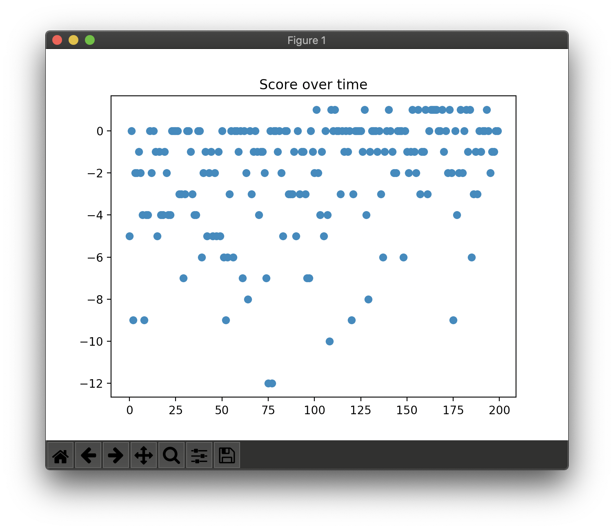

# DQN

DQN is the Q-learning using deep neural network with some optimization methods and strategies. There are two major diff. beside a Q-NN.

| Problem | Description | Solution |
| ------- | ----------- | -------- |
| Non-stationary targets | makes learning unstable | Fixed Q-targets | 
| Correlation between samples | makes W biased | Replay Memory |

## Concrete example

```
Map:
[['Start    ', 'Normal   ', 'Normal   ', 'Normal   ', 'Normal   ', 'Normal   '],
 ['Normal   ', 'Normal   ', 'Normal   ', 'Normal   ', 'Normal   ', 'Normal   '],
 ['Normal   ', 'Normal   ', 'Normal   ', 'Normal   ', 'Normal   ', 'Normal   '],
 ['Normal   ', 'Normal   ', 'Normal   ', 'Normal   ', 'Obstacle ', 'Normal   '],
 ['Normal   ', 'Normal   ', 'Obstacle ', 'Obstacle ', 'Goal     ', 'Obstacle '],
 ['Normal   ', 'Normal   ', 'Normal   ', 'Normal   ', 'Normal   ', 'Normal   ']]
```

## Result

```
> Setting: Namespace(e=0.998, lr=0.001, r=200, s=100, y=0.95)
(Episode:   199, Steps:    12)
Score over time: -1.95
```



```
Final Q-Table:
array([[1.051, 1.103, 1.049, 1.1  ],
       [1.101, 1.256, 1.051, 1.049],
       [1.049, 1.101, 1.104, 0.949],
       [0.956, 1.048, 1.049, 0.974],
       [0.954, 1.087, 0.957, 0.911],
       [0.873, 1.027, 0.98 , 0.909],
       [1.05 , 1.257, 1.103, 1.256],
       [1.101, 1.408, 1.102, 1.104],
       [1.05 , 1.256, 1.256, 1.048],
       [0.954, 1.101, 1.099, 1.09 ],
       [0.976, 1.173, 1.044, 1.007],
       [0.952, 1.181, 1.133, 1.053],
       [1.105, 1.407, 1.259, 1.408],
       [1.253, 1.545, 1.257, 1.257],
       [1.101, 1.408, 1.409, 1.1  ],
       [1.048, 1.254, 1.257, 1.172],
       [1.086, 1.295, 1.1  , 1.146],
       [1.009, 1.251, 1.157, 1.137],
       [1.258, 1.546, 1.411, 1.545],
       [1.409, 1.665, 1.41 , 1.408],
       [1.257, 0.833, 1.545, 1.255],
       [1.1  , 1.285, 1.409, 1.289],
       [1.183, 2.486, 1.252, 1.256],
       [1.189, 1.425, 1.291, 1.182],
       [1.41 , 1.667, 1.547, 1.665],
       [1.545, 1.834, 1.547, 0.833],
       [1.409, 1.991, 1.666, 1.285],
       [1.256, 2.123, 0.833, 2.486],
       [1.137, 1.627, 1.41 , 1.175],
       [1.263, 1.96 , 2.484, 1.379],
       [1.547, 1.666, 1.666, 1.833],
       [1.665, 1.833, 1.665, 1.991],
       [0.833, 1.991, 1.835, 2.124],
       [1.286, 2.123, 1.992, 2.287],
       [2.486, 2.287, 2.124, 2.123],
       [1.287, 2.124, 2.286, 2.118]])
Map:
[['Start    ', 'Normal   ', 'Normal   ', 'Normal   ', 'Normal   ', 'Normal   '],
 ['Normal   ', 'Normal   ', 'Normal   ', 'Normal   ', 'Normal   ', 'Normal   '],
 ['Normal   ', 'Normal   ', 'Normal   ', 'Normal   ', 'Normal   ', 'Normal   '],
 ['Normal   ', 'Normal   ', 'Normal   ', 'Normal   ', 'Obstacle ', 'Normal   '],
 ['Normal   ', 'Normal   ', 'Obstacle ', 'Obstacle ', 'Goal     ', 'Obstacle '],
 ['Normal   ', 'Normal   ', 'Normal   ', 'Normal   ', 'Normal   ', 'Normal   ']]
Q-map:
[['Down     ', 'Down     ', 'Left     ', 'Left     ', 'Down     ', 'Down     '],
 ['Down     ', 'Down     ', 'Down     ', 'Down     ', 'Down     ', 'Down     '],
 ['Right    ', 'Down     ', 'Left     ', 'Left     ', 'Down     ', 'Down     '],
 ['Down     ', 'Down     ', 'Left     ', 'Left     ', 'Down     ', 'Down     '],
 ['Down     ', 'Down     ', 'Down     ', 'Right    ', 'Down     ', 'Left     '],
 ['Right    ', 'Right    ', 'Right    ', 'Right    ', 'Up       ', 'Left     ']]
```
