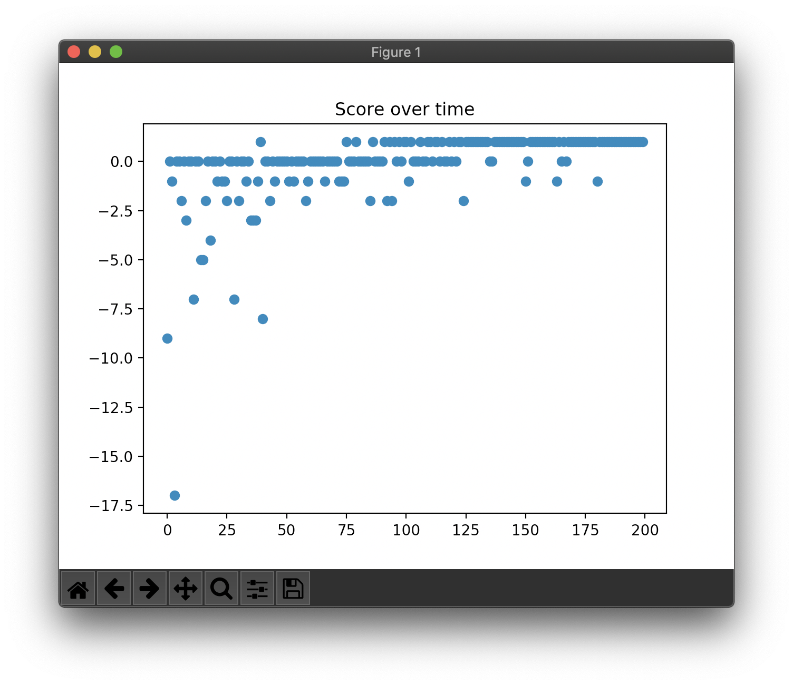

# DDQN

DDQN is the Double Q-learning using two deep neural networks. DDQN solves over-estimation problem in Q-learning with double estimator instead of maximum estimator. In DDQN, selecting action and expectation(evaluation) of action value are divided.

## Concrete example

```
Map:
[['Start    ', 'Normal   ', 'Normal   ', 'Normal   ', 'Normal   ', 'Normal   '],
 ['Normal   ', 'Normal   ', 'Normal   ', 'Normal   ', 'Normal   ', 'Normal   '],
 ['Normal   ', 'Normal   ', 'Normal   ', 'Normal   ', 'Normal   ', 'Normal   '],
 ['Normal   ', 'Normal   ', 'Normal   ', 'Normal   ', 'Obstacle ', 'Normal   '],
 ['Normal   ', 'Normal   ', 'Obstacle ', 'Obstacle ', 'Goal     ', 'Obstacle '],
 ['Normal   ', 'Normal   ', 'Normal   ', 'Normal   ', 'Normal   ', 'Normal   ']]
```

## Result

```
> Setting: Namespace(e=0.998, lr=0.001, r=200, s=100, y=0.95)
(Episode:   199, Steps:    13)
Score over time: -1.575
```



```
Final Q-Table:
array([[1.012, 1.102, 1.012, 1.103],
       [1.104, 1.195, 1.012, 1.012],
       [1.011, 1.103, 1.103, 0.905],
       [0.91 , 1.014, 1.01 , 0.907],
       [0.896, 0.999, 0.908, 0.808],
       [0.803, 0.932, 0.911, 0.84 ],
       [1.012, 1.195, 1.103, 1.196],
       [1.103, 1.346, 1.103, 1.103],
       [1.012, 1.196, 1.195, 1.013],
       [0.902, 1.102, 1.106, 0.998],
       [0.912, 1.104, 1.062, 0.928],
       [0.807, 0.997, 1.023, 0.935],
       [1.103, 1.347, 1.196, 1.346],
       [1.196, 1.498, 1.196, 1.196],
       [1.103, 1.347, 1.346, 1.104],
       [1.013, 1.196, 1.196, 1.104],
       [0.997, 1.208, 1.104, 0.997],
       [0.934, 1.103, 1.109, 1.016],
       [1.196, 1.499, 1.347, 1.499],
       [1.346, 1.623, 1.347, 1.347],
       [1.195, 0.772, 1.499, 1.196],
       [1.104, 1.208, 1.347, 1.209],
       [1.092, 2.375, 1.196, 1.131],
       [0.972, 1.209, 1.207, 1.088],
       [1.347, 1.624, 1.498, 1.623],
       [1.498, 1.772, 1.499, 0.771],
       [1.347, 1.902, 1.623, 1.208],
       [1.196, 2.054, 0.773, 2.376],
       [1.143, 1.49 , 1.253, 1.289],
       [1.103, 2.017, 2.375, 1.209],
       [1.499, 1.623, 1.623, 1.772],
       [1.624, 1.772, 1.624, 1.902],
       [0.771, 1.903, 1.772, 2.054],
       [1.208, 2.053, 1.903, 2.209],
       [2.376, 2.209, 2.053, 2.053],
       [1.209, 2.053, 2.209, 2.053]])
Map:
[['Start    ', 'Normal   ', 'Normal   ', 'Normal   ', 'Normal   ', 'Normal   '],
 ['Normal   ', 'Normal   ', 'Normal   ', 'Normal   ', 'Normal   ', 'Normal   '],
 ['Normal   ', 'Normal   ', 'Normal   ', 'Normal   ', 'Normal   ', 'Normal   '],
 ['Normal   ', 'Normal   ', 'Normal   ', 'Normal   ', 'Obstacle ', 'Normal   '],
 ['Normal   ', 'Normal   ', 'Obstacle ', 'Obstacle ', 'Goal     ', 'Obstacle '],
 ['Normal   ', 'Normal   ', 'Normal   ', 'Normal   ', 'Normal   ', 'Normal   ']]
Q-map:
[['Right    ', 'Down     ', 'Down     ', 'Down     ', 'Down     ', 'Down     '],
 ['Right    ', 'Down     ', 'Down     ', 'Left     ', 'Down     ', 'Left     '],
 ['Down     ', 'Down     ', 'Down     ', 'Left     ', 'Down     ', 'Left     '],
 ['Right    ', 'Down     ', 'Left     ', 'Left     ', 'Down     ', 'Down     '],
 ['Down     ', 'Down     ', 'Down     ', 'Right    ', 'Down     ', 'Left     '],
 ['Right    ', 'Right    ', 'Right    ', 'Right    ', 'Up       ', 'Left     ']]
```
