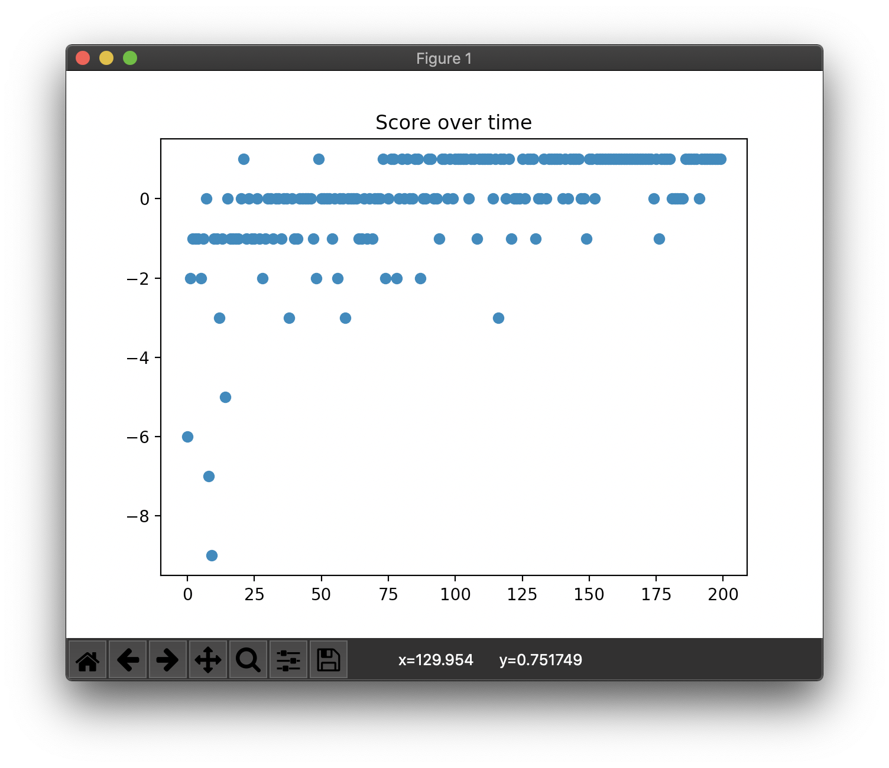

# D3QN

Consider the given state *s'* where all actions on *s'* lead to ending the game. The all result of Q on *s'* may have an inherently low value and nobody cares about the actions. It is undesirable.

However, in Dueling DQN, there is a difference between the *value* of a particular *state* and the *actions* proceeding from that *state*. Dueling DQN makes Q function implicitly calculating two quantities:

- *V(s)*: the *value* of being in state *s*.
- *A(s, a)*: the *advantage* of taking action *a* in state *s*.

*Q(s, a) = V(s) + A(s, a)*

Dueling Double DQN (D3QN) is the Dueling DQN with a DDQN(Double DQN) method.

## Concrete example

```
Map:
[['Start    ', 'Normal   ', 'Normal   ', 'Normal   ', 'Normal   ', 'Normal   '],
 ['Normal   ', 'Normal   ', 'Normal   ', 'Normal   ', 'Normal   ', 'Normal   '],
 ['Normal   ', 'Normal   ', 'Normal   ', 'Normal   ', 'Normal   ', 'Normal   '],
 ['Normal   ', 'Normal   ', 'Normal   ', 'Normal   ', 'Obstacle ', 'Normal   '],
 ['Normal   ', 'Normal   ', 'Obstacle ', 'Obstacle ', 'Goal     ', 'Obstacle '],
 ['Normal   ', 'Normal   ', 'Normal   ', 'Normal   ', 'Normal   ', 'Normal   ']]
```

## Result

```
> Setting: Namespace(e=0.989, lr=0.001, r=200, s=100, y=0.95)
(Episode:   199, Steps:     9)
Score over time: -0.02
```



```
Final Q-Table:
array([[0.755, 0.829, 0.754, 0.831],
       [0.837, 0.999, 0.752, 0.753],
       [0.744, 0.833, 0.828, 0.668],
       [0.667, 0.746, 0.745, 0.621],
       [0.628, 0.703, 0.667, 0.583],
       [0.539, 0.622, 0.629, 0.58 ],
       [0.762, 0.98 , 0.867, 0.998],
       [0.838, 1.064, 0.835, 0.83 ],
       [0.756, 0.996, 0.999, 0.752],
       [0.676, 0.824, 0.837, 0.689],
       [0.629, 0.737, 0.743, 0.616],
       [0.575, 0.631, 0.679, 0.613],
       [0.816, 1.072, 0.965, 1.064],
       [1.008, 1.164, 0.985, 1.006],
       [0.836, 1.068, 1.066, 0.843],
       [0.76 , 0.983, 0.967, 0.831],
       [0.711, 0.746, 0.828, 0.614],
       [0.615, 0.653, 0.706, 0.632],
       [0.966, 1.166, 1.075, 1.168],
       [1.073, 1.283, 1.072, 1.071],
       [0.973, 0.389, 1.168, 0.974],
       [0.774, 0.832, 1.078, 0.742],
       [0.765, 1.885, 0.87 , 0.666],
       [0.745, 0.752, 0.75 , 0.663],
       [1.078, 1.285, 1.167, 1.28 ],
       [1.162, 1.381, 1.163, 0.38 ],
       [1.067, 1.511, 1.282, 0.68 ],
       [1.069, 1.648, 0.978, 1.885],
       [0.814, 0.966, 0.763, 0.86 ],
       [0.694, 1.551, 1.885, 1.286],
       [1.173, 1.281, 1.282, 1.378],
       [1.278, 1.383, 1.283, 1.509],
       [0.385, 1.502, 1.379, 1.612],
       [0.733, 1.616, 1.51 , 1.744],
       [1.883, 1.744, 1.612, 1.617],
       [0.744, 1.425, 1.746, 1.101]])
Map:
[['Start    ', 'Normal   ', 'Normal   ', 'Normal   ', 'Normal   ', 'Normal   '],
 ['Normal   ', 'Normal   ', 'Normal   ', 'Normal   ', 'Normal   ', 'Normal   '],
 ['Normal   ', 'Normal   ', 'Normal   ', 'Normal   ', 'Normal   ', 'Normal   '],
 ['Normal   ', 'Normal   ', 'Normal   ', 'Normal   ', 'Obstacle ', 'Normal   '],
 ['Normal   ', 'Normal   ', 'Obstacle ', 'Obstacle ', 'Goal     ', 'Obstacle '],
 ['Normal   ', 'Normal   ', 'Normal   ', 'Normal   ', 'Normal   ', 'Normal   ']]
Q-map:
[['Right    ', 'Down     ', 'Down     ', 'Down     ', 'Down     ', 'Left     '],
 ['Right    ', 'Down     ', 'Left     ', 'Left     ', 'Left     ', 'Left     '],
 ['Down     ', 'Down     ', 'Down     ', 'Down     ', 'Left     ', 'Left     '],
 ['Right    ', 'Down     ', 'Left     ', 'Left     ', 'Down     ', 'Down     '],
 ['Down     ', 'Down     ', 'Down     ', 'Right    ', 'Down     ', 'Left     '],
 ['Right    ', 'Right    ', 'Right    ', 'Right    ', 'Up       ', 'Left     ']]
```
