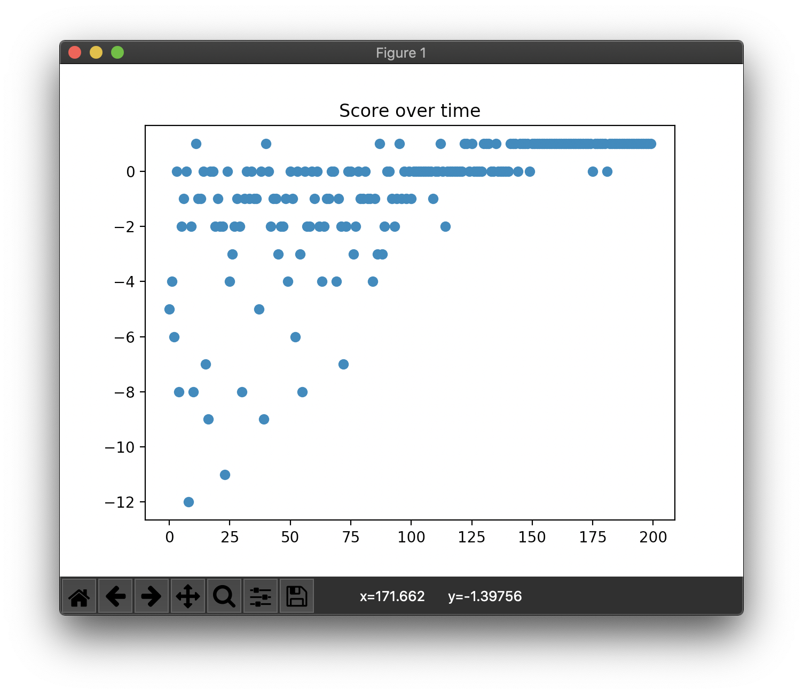

# D3QN

Consider the given state *s'* where all actions on *s'* lead to ending the game. The all result of Q on *s'* may have an inherently low value and nobody cares about the actions. It is undesirable.

However, in Dueling DQN, there is a difference between the *value* of a particular *state* and the *actions* proceeding from that *state*. Dueling DQN makes Q function implicitly calculating two quantities:

- *V(s)*: the *value* of being in state *s*.
- *A(s, a)*: the *advantage* of taking action *a* in state *s*.

*Q(s, a) = V(s) + A(s, a)*

Dueling Double DQN (D3QN) is the Dueling DQN with a DDQN(Double DQN) method.

## Concrete example

```
Map:
[['Start    ', 'Normal   ', 'Normal   ', 'Normal   ', 'Normal   ', 'Normal   '],
 ['Normal   ', 'Normal   ', 'Normal   ', 'Normal   ', 'Normal   ', 'Normal   '],
 ['Normal   ', 'Normal   ', 'Normal   ', 'Normal   ', 'Normal   ', 'Normal   '],
 ['Normal   ', 'Normal   ', 'Normal   ', 'Normal   ', 'Obstacle ', 'Normal   '],
 ['Normal   ', 'Normal   ', 'Obstacle ', 'Obstacle ', 'Goal     ', 'Obstacle '],
 ['Normal   ', 'Normal   ', 'Normal   ', 'Normal   ', 'Normal   ', 'Normal   ']]
```

## Result

```
> Setting: Namespace(e=0.989, lr=0.001, r=200, s=100, y=0.95)
(Episode:   199, Steps:     9)
Score over time: -0.005
```



```
Final Q-Table:
array([[ 0.636,  0.635,  0.613,  0.621],
       [ 0.635,  0.755,  0.604,  0.579],
       [ 0.561,  0.574,  0.569,  0.544],
       [ 0.616,  0.62 ,  0.57 ,  0.552],
       [ 0.561,  0.624,  0.591,  0.566],
       [ 0.683,  0.675,  0.602,  0.58 ],
       [ 0.6  ,  0.732,  0.687,  0.722],
       [ 0.535,  0.719,  0.547,  0.459],
       [ 0.592,  0.736,  0.634,  0.64 ],
       [ 0.576,  0.739,  0.618,  0.575],
       [ 0.592,  0.681,  0.653,  0.682],
       [ 0.575,  0.79 ,  0.623,  0.66 ],
       [ 0.777,  0.756,  0.736,  0.743],
       [ 0.701,  0.919,  0.769,  0.792],
       [ 0.524,  0.924,  0.627,  0.633],
       [ 0.771,  1.033,  0.86 ,  0.906],
       [ 0.623,  0.828,  0.707,  0.713],
       [ 0.667,  0.931,  0.778,  0.775],
       [ 0.605,  0.868,  0.759,  0.901],
       [ 0.738,  1.059,  0.806,  1.01 ],
       [ 1.291,  0.66 ,  0.966,  1.017],
       [ 0.581,  0.571,  0.624,  0.526],
       [ 1.095,  1.721,  1.218,  1.397],
       [ 0.82 , -0.115,  1.284,  0.968],
       [ 0.794,  1.02 ,  0.994,  1.049],
       [ 1.067,  1.127,  1.067,  0.479],
       [ 0.693,  1.283,  0.568,  0.355],
       [ 0.448,  1.37 , -0.087,  1.76 ],
       [ 0.501,  0.803,  0.737,  0.865],
       [ 1.141,  1.483,  1.792,  1.674],
       [ 0.891,  0.919,  0.97 ,  1.086],
       [ 0.559,  0.678,  0.686,  1.255],
       [-0.234,  0.723,  0.731,  1.424],
       [ 0.574,  1.378,  1.165,  1.627],
       [ 1.751,  1.599,  1.443,  1.415],
       [ 0.509,  1.455,  1.61 ,  1.447]])
Map:
[['Start    ', 'Normal   ', 'Normal   ', 'Normal   ', 'Normal   ', 'Normal   '],
 ['Normal   ', 'Normal   ', 'Normal   ', 'Normal   ', 'Normal   ', 'Normal   '],
 ['Normal   ', 'Normal   ', 'Normal   ', 'Normal   ', 'Normal   ', 'Normal   '],
 ['Normal   ', 'Normal   ', 'Normal   ', 'Normal   ', 'Obstacle ', 'Normal   '],
 ['Normal   ', 'Normal   ', 'Obstacle ', 'Obstacle ', 'Goal     ', 'Obstacle '],
 ['Normal   ', 'Normal   ', 'Normal   ', 'Normal   ', 'Normal   ', 'Normal   ']]
Q-map:
[['Up       ', 'Down     ', 'Down     ', 'Down     ', 'Down     ', 'Up       '],
 ['Down     ', 'Down     ', 'Down     ', 'Down     ', 'Right    ', 'Down     '],
 ['Up       ', 'Down     ', 'Down     ', 'Down     ', 'Down     ', 'Down     '],
 ['Right    ', 'Down     ', 'Up       ', 'Left     ', 'Down     ', 'Left     '],
 ['Right    ', 'Down     ', 'Down     ', 'Right    ', 'Right    ', 'Left     '],
 ['Right    ', 'Right    ', 'Right    ', 'Right    ', 'Up       ', 'Left     ']]
```
