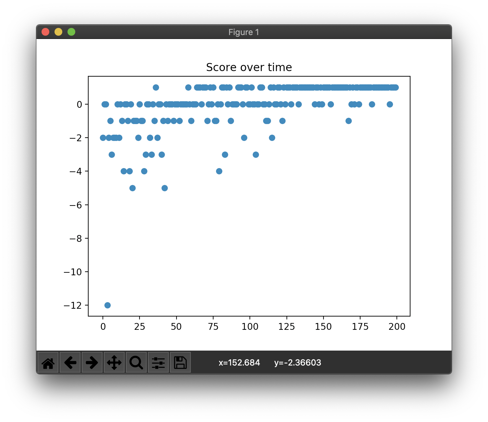

# DDQN

DDQN is the Double Q-learning using two deep neural networks. DDQN solves over-estimation problem in Q-learning with double estimator instead of maximum estimator. In DDQN, selecting action and expectation(evaluation) of action value are divided.

## Concrete example

```
Map:
[['Start    ', 'Normal   ', 'Normal   ', 'Normal   ', 'Normal   ', 'Normal   '],
 ['Normal   ', 'Normal   ', 'Normal   ', 'Normal   ', 'Normal   ', 'Normal   '],
 ['Normal   ', 'Normal   ', 'Normal   ', 'Normal   ', 'Normal   ', 'Normal   '],
 ['Normal   ', 'Normal   ', 'Normal   ', 'Normal   ', 'Obstacle ', 'Normal   '],
 ['Normal   ', 'Normal   ', 'Obstacle ', 'Obstacle ', 'Goal     ', 'Obstacle '],
 ['Normal   ', 'Normal   ', 'Normal   ', 'Normal   ', 'Normal   ', 'Normal   ']]
```

## Result

```
> Setting: Namespace(e=0.989, lr=0.001, r=200, s=100, y=0.95)
(Episode:   199, Steps:    10)
Score over time: -0.05
```



```
Final Q-Table:
array([[ 0.637,  0.653,  0.63 ,  0.651],
       [ 0.662,  0.691,  0.634,  0.658],
       [ 0.651,  0.644,  0.67 ,  0.59 ],
       [ 0.564,  0.65 ,  0.662,  0.399],
       [ 0.477,  0.451,  0.495,  0.502],
       [ 0.498,  0.416,  0.462,  0.486],
       [ 0.622,  0.684,  0.651,  0.697],
       [ 0.656,  0.703,  0.629,  0.666],
       [ 0.64 ,  0.693,  0.687,  0.656],
       [ 0.582,  0.665,  0.676,  0.481],
       [ 0.488,  0.575,  0.522,  0.526],
       [ 0.58 ,  0.486,  0.507,  0.564],
       [ 0.682,  0.708,  0.687,  0.708],
       [ 0.692,  0.738,  0.689,  0.686],
       [ 0.614,  0.708,  0.709,  0.64 ],
       [ 0.657,  0.649,  0.695,  0.647],
       [ 0.616,  0.482,  0.659,  0.514],
       [ 0.549,  0.436,  0.498,  0.503],
       [ 0.682,  0.743,  0.704,  0.738],
       [ 0.71 ,  0.778,  0.715,  0.707],
       [ 0.693, -0.184,  0.738,  0.634],
       [ 0.659, -0.031,  0.166, -0.027],
       [ 0.636,  1.001,  0.609,  0.298],
       [ 0.476, -0.06 , -0.027,  0.436],
       [ 0.777,  0.778,  0.778,  0.785],
       [ 0.737,  0.81 ,  0.74 , -0.192],
       [ 0.715,  0.855,  0.773, -0.044],
       [ 0.568,  0.906, -0.125,  0.999],
       [ 0.655,  0.545,  0.475,  0.322],
       [ 0.399,  0.677,  1.   ,  0.048],
       [ 0.804,  0.751,  0.769,  0.813],
       [ 0.785,  0.812,  0.774,  0.856],
       [-0.19 ,  0.856,  0.81 ,  0.906],
       [-0.051,  0.906,  0.854,  0.951],
       [ 1.   ,  0.949,  0.903,  0.908],
       [-0.053,  0.906,  0.953,  0.907]])
Map:
[['Start    ', 'Normal   ', 'Normal   ', 'Normal   ', 'Normal   ', 'Normal   '],
 ['Normal   ', 'Normal   ', 'Normal   ', 'Normal   ', 'Normal   ', 'Normal   '],
 ['Normal   ', 'Normal   ', 'Normal   ', 'Normal   ', 'Normal   ', 'Normal   '],
 ['Normal   ', 'Normal   ', 'Normal   ', 'Normal   ', 'Obstacle ', 'Normal   '],
 ['Normal   ', 'Normal   ', 'Obstacle ', 'Obstacle ', 'Goal     ', 'Obstacle '],
 ['Normal   ', 'Normal   ', 'Normal   ', 'Normal   ', 'Normal   ', 'Normal   ']]
Q-map:
[['Down     ', 'Down     ', 'Left     ', 'Left     ', 'Right    ', 'Up       '],
 ['Right    ', 'Down     ', 'Down     ', 'Left     ', 'Down     ', 'Up       '],
 ['Down     ', 'Down     ', 'Left     ', 'Left     ', 'Left     ', 'Up       '],
 ['Down     ', 'Down     ', 'Left     ', 'Up       ', 'Down     ', 'Up       '],
 ['Right    ', 'Down     ', 'Down     ', 'Right    ', 'Up       ', 'Left     '],
 ['Right    ', 'Right    ', 'Right    ', 'Right    ', 'Up       ', 'Left     ']]
```
