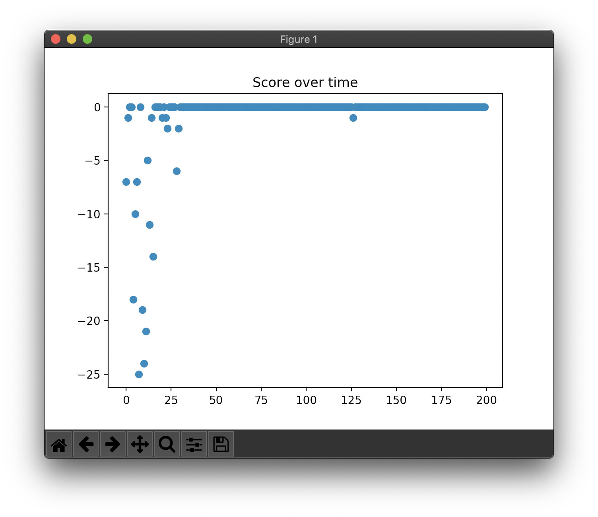

# NoisyNet (DQN-based)

NoisyNet (Noisy Networks) replaces e-greedy heuristics and performs efficient exploration.
The parameters of the noise are learned with gradient descent along with the remaining network weights.

* Using Factorised Gaussian noise.
* DQN take one step of optimisation for every action step, the noisy network parameters are re-sampled before every action.

## References

* Fortunato, Meire, et al. "Noisy networks for exploration." arXiv preprint arXiv:1706.10295 (2017).

## TODO

- [ ] CNN -> Fully connected layer(s).
- [ ] Test: Combining DDQN, Dueling DQN, D3QN

## Concrete example

```
Map:
[['Start    ', 'Normal   ', 'Normal   ', 'Normal   ', 'Normal   ', 'Normal   '],
 ['Normal   ', 'Normal   ', 'Normal   ', 'Normal   ', 'Normal   ', 'Normal   '],
 ['Normal   ', 'Normal   ', 'Normal   ', 'Normal   ', 'Normal   ', 'Normal   '],
 ['Normal   ', 'Normal   ', 'Normal   ', 'Normal   ', 'Obstacle ', 'Normal   '],
 ['Normal   ', 'Normal   ', 'Obstacle ', 'Obstacle ', 'Goal     ', 'Obstacle '],
 ['Normal   ', 'Normal   ', 'Normal   ', 'Normal   ', 'Normal   ', 'Normal   ']]
```

<!--
## Result

```
> Setting: Namespace(lr=0.001, r=200, s=100, y=0.95)
(Episode:   199, Steps:    99)
Score over time: -0.88
```



```
Final Q-Table:
array([[-0.086,  0.074,  0.064,  0.073],
       [-0.088,  0.081,  0.066,  0.079],
       [-0.087,  0.083,  0.066,  0.081],
       [-0.086,  0.075,  0.064,  0.075],
       [-0.086,  0.075,  0.064,  0.074],
       [-0.087,  0.073,  0.064,  0.073],
       [-0.085,  0.07 ,  0.063,  0.069],
       [-0.088,  0.082,  0.066,  0.08 ],
       [-0.09 ,  0.09 ,  0.068,  0.087],
       [-0.091,  0.092,  0.068,  0.088],
       [-0.087,  0.081,  0.066,  0.079],
       [-0.088,  0.083,  0.066,  0.081],
       [-0.083,  0.069,  0.063,  0.068],
       [-0.087,  0.08 ,  0.065,  0.077],
       [-0.09 ,  0.092,  0.069,  0.088],
       [-0.091,  0.09 ,  0.068,  0.085],
       [ 0.009, -0.108,  0.074,  0.081],
       [-0.088,  0.084,  0.067,  0.082],
       [-0.084,  0.069,  0.062,  0.07 ],
       [-0.086,  0.075,  0.064,  0.074],
       [ 0.084, -0.246,  0.063,  0.089],
       [ 0.085, -0.255,  0.09 ,  0.008],
       [ 0.018,  1.163,  0.109,  0.128],
       [ 0.081, -0.24 ,  0.067,  0.084],
       [-0.083,  0.064,  0.061,  0.064],
       [ 0.076, -0.28 ,  0.058, -0.208],
       [-0.084,  0.159,  0.071,  0.088],
       [-0.088,  0.084,  0.066,  0.082],
       [-0.063,  0.115,  0.078,  0.088],
       [ 0.005,  0.04 ,  0.176, -0.238],
       [-0.08 ,  0.06 ,  0.06 ,  0.062],
       [-0.081,  0.059,  0.06 ,  0.061],
       [-0.082,  0.061,  0.06 ,  0.061],
       [-0.081,  0.061,  0.06 ,  0.063],
       [-0.081,  0.06 ,  0.06 ,  0.061],
       [-0.082,  0.059,  0.06 ,  0.062]])
Map:
[['Start    ', 'Normal   ', 'Normal   ', 'Normal   ', 'Normal   ', 'Normal   '],
 ['Normal   ', 'Normal   ', 'Normal   ', 'Normal   ', 'Normal   ', 'Normal   '],
 ['Normal   ', 'Normal   ', 'Normal   ', 'Normal   ', 'Normal   ', 'Normal   '],
 ['Normal   ', 'Normal   ', 'Normal   ', 'Normal   ', 'Obstacle ', 'Normal   '],
 ['Normal   ', 'Normal   ', 'Obstacle ', 'Obstacle ', 'Goal     ', 'Obstacle '],
 ['Normal   ', 'Normal   ', 'Normal   ', 'Normal   ', 'Normal   ', 'Normal   ']]
Q-map:
[['Down     ', 'Down     ', 'Down     ', 'Down     ', 'Down     ', 'Down     '],
 ['Down     ', 'Down     ', 'Down     ', 'Down     ', 'Down     ', 'Down     '],
 ['Down     ', 'Down     ', 'Down     ', 'Down     ', 'Right    ', 'Down     '],
 ['Right    ', 'Down     ', 'Right    ', 'Left     ', 'Down     ', 'Right    '],
 ['Right    ', 'Up       ', 'Down     ', 'Down     ', 'Down     ', 'Left     '],
 ['Right    ', 'Right    ', 'Right    ', 'Right    ', 'Right    ', 'Right    ']]
```
-->
