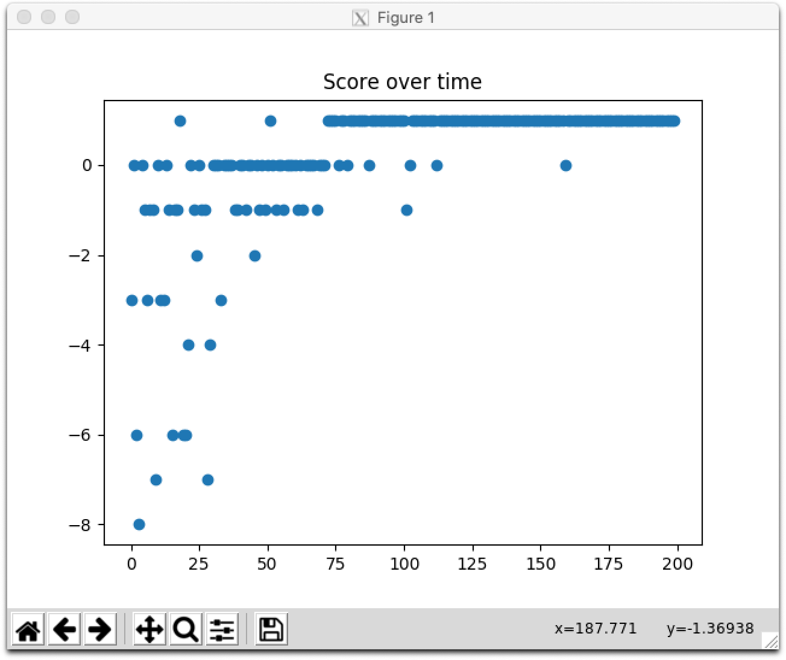

# PER (DQN-based)

In normal DQN, experience transitions were uniformly sampled from a replay memory regardless of their significance. PER replays important transitions more frequently.

## References

Schaul, Tom, et al. "Prioritized experience replay." arXiv preprint arXiv:1511.05952 (2015).

## TODO

- [ ] PER typically uses lower learning rates: Decreasing lr (lr /= 4)
- [ ] Test: Combining DDQN, Dueling DQN, D3QN
- [ ] Test: Combining NoisyNet

## Concrete example

```
Map:
[['Start    ', 'Normal   ', 'Normal   ', 'Normal   ', 'Normal   ', 'Normal   '],
 ['Normal   ', 'Normal   ', 'Normal   ', 'Normal   ', 'Normal   ', 'Normal   '],
 ['Normal   ', 'Normal   ', 'Normal   ', 'Normal   ', 'Normal   ', 'Normal   '],
 ['Normal   ', 'Normal   ', 'Normal   ', 'Normal   ', 'Obstacle ', 'Normal   '],
 ['Normal   ', 'Normal   ', 'Obstacle ', 'Obstacle ', 'Goal     ', 'Obstacle '],
 ['Normal   ', 'Normal   ', 'Normal   ', 'Normal   ', 'Normal   ', 'Normal   ']]
```

## Result

```
> Setting: Namespace(e=0.989, lr=0.001, r=200, s=100, y=0.95)
(Episode:   199, Steps:     9)
Score over time: 0.065
```



```
Final Q-Table:
array([[ 0.603,  0.64 ,  0.602,  0.64 ],
       [ 0.639,  0.666,  0.609,  0.601],
       [ 0.612,  0.636,  0.633,  0.613],
       [ 0.62 ,  0.631,  0.625,  0.405],
       [ 0.582,  0.654,  0.451,  0.582],
       [ 0.585,  0.621,  0.623,  0.585],
       [ 0.603,  0.666,  0.64 ,  0.666],
       [ 0.637,  0.702,  0.641,  0.638],
       [ 0.627,  0.666,  0.67 ,  0.637],
       [ 0.615,  0.661,  0.651,  0.652],
       [ 0.611,  0.628,  0.7  ,  0.623],
       [ 0.568,  0.603,  0.662,  0.625],
       [ 0.636,  0.703,  0.667,  0.702],
       [ 0.665,  0.738,  0.666,  0.665],
       [ 0.652,  0.693,  0.701,  0.656],
       [ 0.561,  0.663,  0.685,  0.621],
       [ 0.656, -0.054,  0.649,  0.591],
       [ 0.623,  0.569,  0.626,  0.592],
       [ 0.666,  0.737,  0.705,  0.738],
       [ 0.703,  0.774,  0.703,  0.7  ],
       [ 0.671, -0.103,  0.737,  0.663],
       [ 0.66 ,  0.167,  0.701, -0.044],
       [ 0.632,  0.999,  0.639,  0.499],
       [ 0.597, -0.042, -0.064,  0.58 ],
       [ 0.715,  0.774,  0.736,  0.774],
       [ 0.738,  0.816,  0.738, -0.187],
       [ 0.724,  0.856,  0.77 ,  0.072],
       [ 0.303,  0.374, -0.176,  1.   ],
       [ 0.572,  0.41 ,  0.564,  0.638],
       [ 0.624,  0.903,  1.002,  0.034],
       [ 0.737,  0.775,  0.775,  0.816],
       [ 0.774,  0.816,  0.775,  0.857],
       [-0.186,  0.858,  0.816,  0.903],
       [-0.048,  0.903,  0.859,  0.949],
       [ 1.   ,  0.951,  0.896,  0.903],
       [-0.044,  0.905,  0.949,  0.902]])
Map:
[['Start    ', 'Normal   ', 'Normal   ', 'Normal   ', 'Normal   ', 'Normal   '],
 ['Normal   ', 'Normal   ', 'Normal   ', 'Normal   ', 'Normal   ', 'Normal   '],
 ['Normal   ', 'Normal   ', 'Normal   ', 'Normal   ', 'Normal   ', 'Normal   '],
 ['Normal   ', 'Normal   ', 'Normal   ', 'Normal   ', 'Obstacle ', 'Normal   '],
 ['Normal   ', 'Normal   ', 'Obstacle ', 'Obstacle ', 'Goal     ', 'Obstacle '],
 ['Normal   ', 'Normal   ', 'Normal   ', 'Normal   ', 'Normal   ', 'Normal   ']]
Q-map:
[['Down     ', 'Down     ', 'Down     ', 'Down     ', 'Down     ', 'Left     '],
 ['Right    ', 'Down     ', 'Left     ', 'Down     ', 'Left     ', 'Left     '],
 ['Down     ', 'Down     ', 'Left     ', 'Left     ', 'Up       ', 'Left     '],
 ['Right    ', 'Down     ', 'Left     ', 'Left     ', 'Down     ', 'Up       '],
 ['Down     ', 'Down     ', 'Down     ', 'Right    ', 'Right    ', 'Left     '],
 ['Right    ', 'Right    ', 'Right    ', 'Right    ', 'Up       ', 'Left     ']]
```
