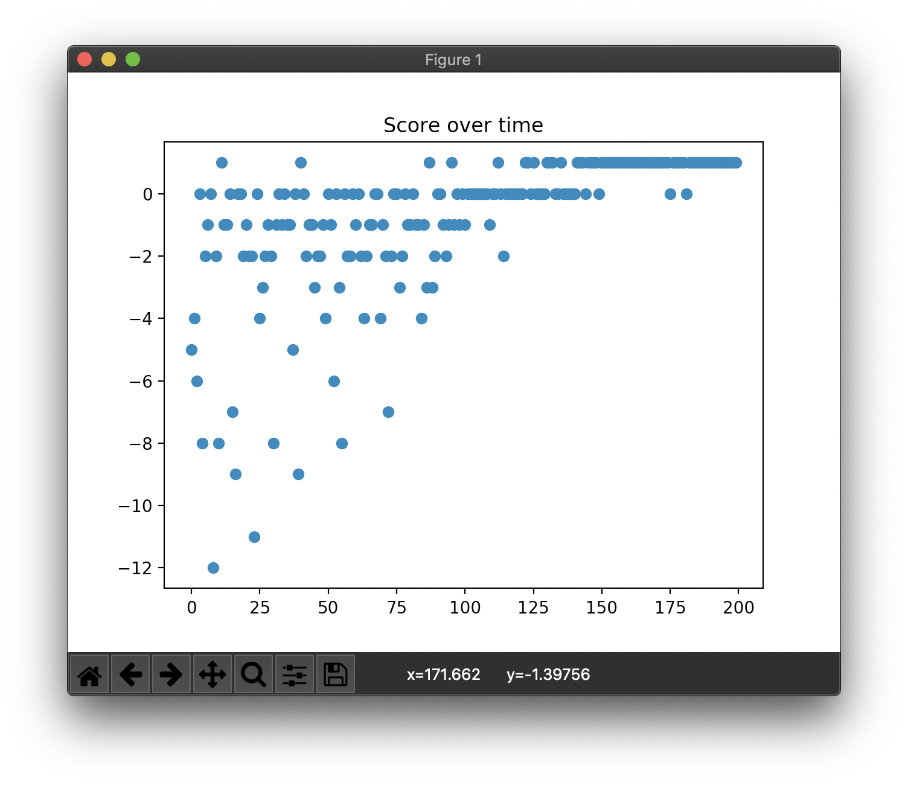

# D3QN

Consider the given state *s'* where all actions on *s'* lead to ending the game. The all result of Q on *s'* may have an inherently low value and nobody cares about the actions. It is undesirable.

However, in Dueling DQN, there is a difference between the *value* of a particular *state* and the *actions* proceeding from that *state*. Dueling DQN makes Q function implicitly calculating two quantities:

- *V(s)*: the *value* of being in state *s*.
- *A(s, a)*: the *advantage* of taking action *a* in state *s*.

*Q(s, a) = V(s) + A(s, a)*

Dueling Double DQN (D3QN) is the Dueling DQN with a DDQN(Double DQN) method.

## Concrete example

```
Map:
[['Start    ', 'Normal   ', 'Normal   ', 'Normal   ', 'Normal   ', 'Normal   '],
 ['Normal   ', 'Normal   ', 'Normal   ', 'Normal   ', 'Normal   ', 'Normal   '],
 ['Normal   ', 'Normal   ', 'Normal   ', 'Normal   ', 'Normal   ', 'Normal   '],
 ['Normal   ', 'Normal   ', 'Normal   ', 'Normal   ', 'Obstacle ', 'Normal   '],
 ['Normal   ', 'Normal   ', 'Obstacle ', 'Obstacle ', 'Goal     ', 'Obstacle '],
 ['Normal   ', 'Normal   ', 'Normal   ', 'Normal   ', 'Normal   ', 'Normal   ']]
```

## Result

```
> Setting: Namespace(e=0.989, lr=0.001, r=200, s=100, y=0.95)
(Episode:   199, Steps:    10)
Score over time: -0.76
```



```
Final Q-Table:
array([[ 0.403,  0.501,  0.409,  0.489],
       [ 0.288,  0.509,  0.349,  0.396],
       [ 0.418,  0.49 ,  0.252,  0.393],
       [ 0.139,  0.431,  0.303,  0.222],
       [ 0.343,  0.587,  0.401,  0.385],
       [ 0.383,  0.399,  0.499,  0.494],
       [ 0.397,  0.539,  0.499,  0.522],
       [ 0.375,  0.583,  0.45 ,  0.518],
       [ 0.488,  0.56 ,  0.588,  0.45 ],
       [ 0.436,  0.545,  0.543,  0.501],
       [ 0.499,  0.54 ,  0.474,  0.492],
       [ 0.31 ,  0.553,  0.459,  0.422],
       [ 0.47 ,  0.546,  0.512,  0.588],
       [ 0.412,  0.662,  0.51 ,  0.545],
       [ 0.419,  0.612,  0.566,  0.477],
       [ 0.458,  0.578,  0.592,  0.576],
       [ 0.581,  0.116,  0.575,  0.645],
       [ 0.512,  0.603,  0.667,  0.6  ],
       [ 0.354,  0.336,  0.464,  0.629],
       [ 0.444,  0.699,  0.473,  0.599],
       [ 0.587, -0.102,  0.694,  0.603],
       [ 0.554, -0.011,  0.656,  0.166],
       [ 0.504,  1.012,  0.459,  0.314],
       [ 0.588,  0.131,  0.447,  0.62 ],
       [ 0.313,  0.453,  0.647,  0.702],
       [ 0.715,  0.78 ,  0.706, -0.057],
       [ 0.658,  0.856,  0.82 ,  0.195],
       [ 1.011,  0.881,  0.249,  0.991],
       [ 0.538,  0.65 ,  0.771,  0.545],
       [ 0.381,  0.636,  1.048,  0.329],
       [ 0.692,  0.659,  0.682,  0.776],
       [ 0.303,  0.072,  0.125,  0.846],
       [ 0.01 ,  0.895,  0.827,  0.914],
       [-0.165,  0.832,  0.765,  0.933],
       [ 0.983,  0.699,  0.7  ,  0.024],
       [ 0.015,  0.523,  0.958,  0.483]])
Map:
[['Start    ', 'Normal   ', 'Normal   ', 'Normal   ', 'Normal   ', 'Normal   '],
 ['Normal   ', 'Normal   ', 'Normal   ', 'Normal   ', 'Normal   ', 'Normal   '],
 ['Normal   ', 'Normal   ', 'Normal   ', 'Normal   ', 'Normal   ', 'Normal   '],
 ['Normal   ', 'Normal   ', 'Normal   ', 'Normal   ', 'Obstacle ', 'Normal   '],
 ['Normal   ', 'Normal   ', 'Obstacle ', 'Obstacle ', 'Goal     ', 'Obstacle '],
 ['Normal   ', 'Normal   ', 'Normal   ', 'Normal   ', 'Normal   ', 'Normal   ']]
Q-map:
[['Down     ', 'Down     ', 'Down     ', 'Down     ', 'Down     ', 'Left     '],
 ['Down     ', 'Down     ', 'Left     ', 'Down     ', 'Down     ', 'Down     '],
 ['Right    ', 'Down     ', 'Down     ', 'Left     ', 'Right    ', 'Left     '],
 ['Right    ', 'Down     ', 'Left     ', 'Left     ', 'Down     ', 'Right    '],
 ['Right    ', 'Down     ', 'Down     ', 'Up       ', 'Left     ', 'Left     '],
 ['Right    ', 'Right    ', 'Right    ', 'Right    ', 'Up       ', 'Left     ']]
```
